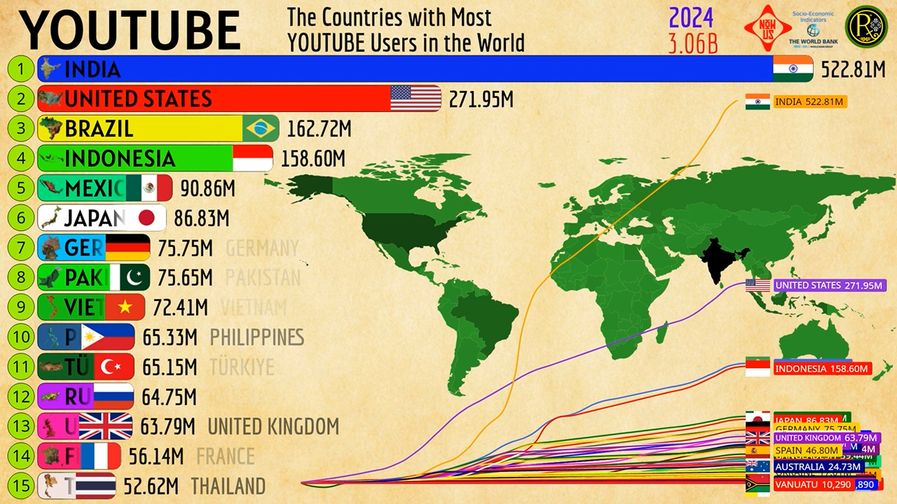
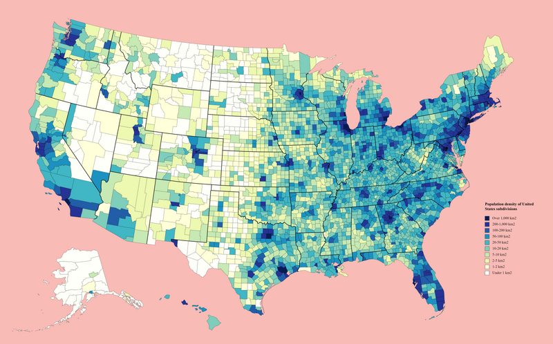
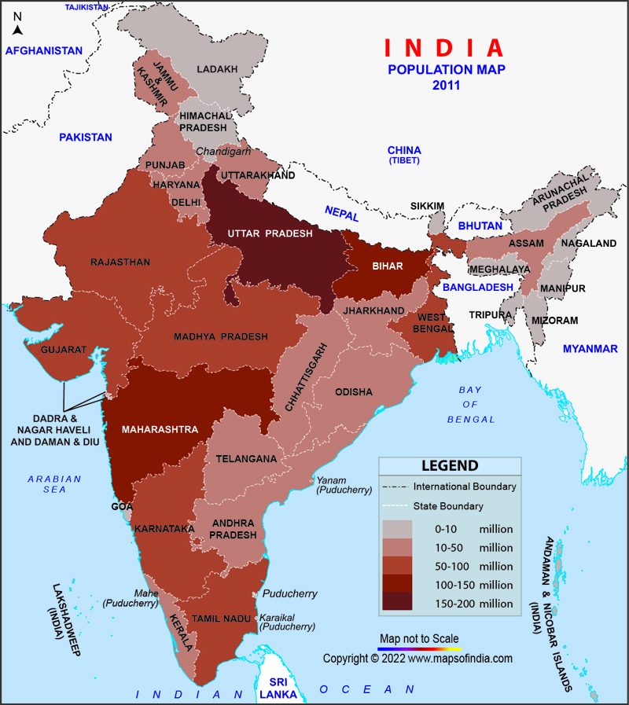
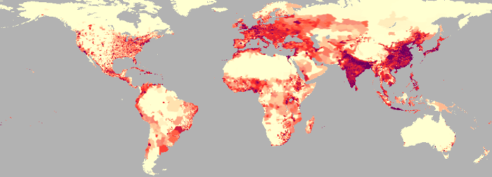
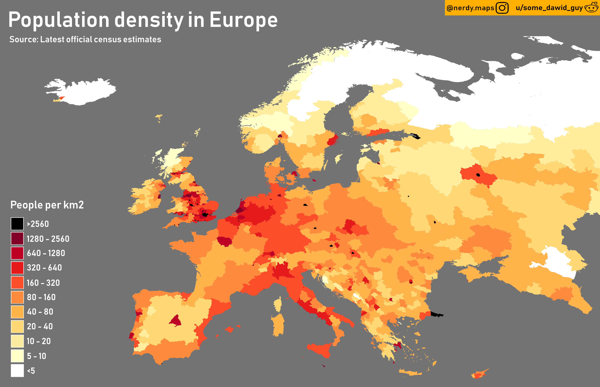
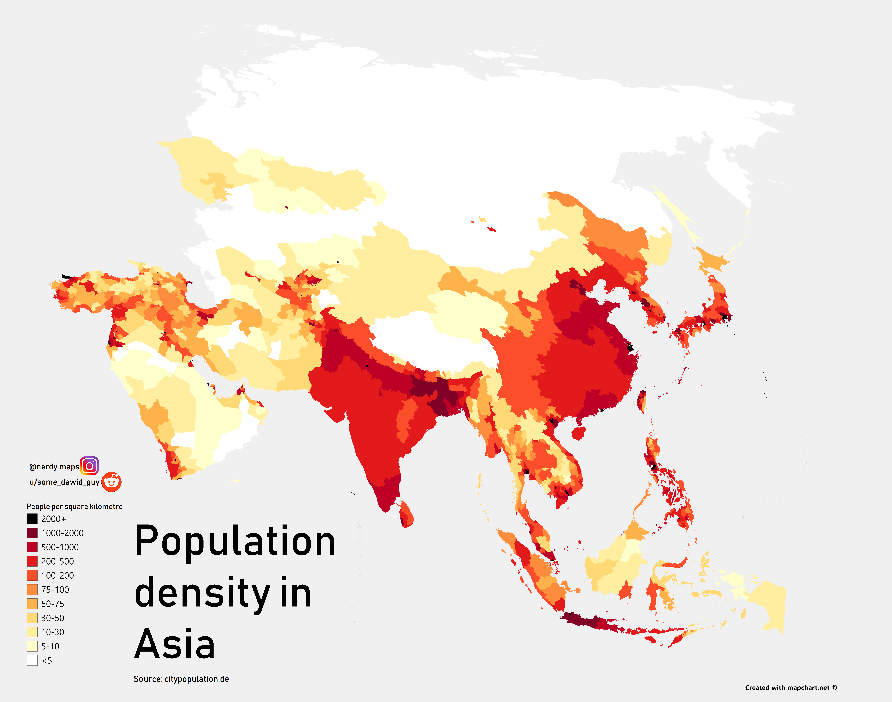
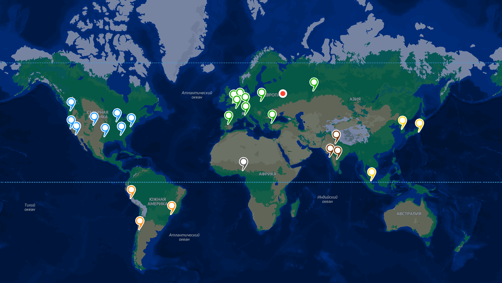
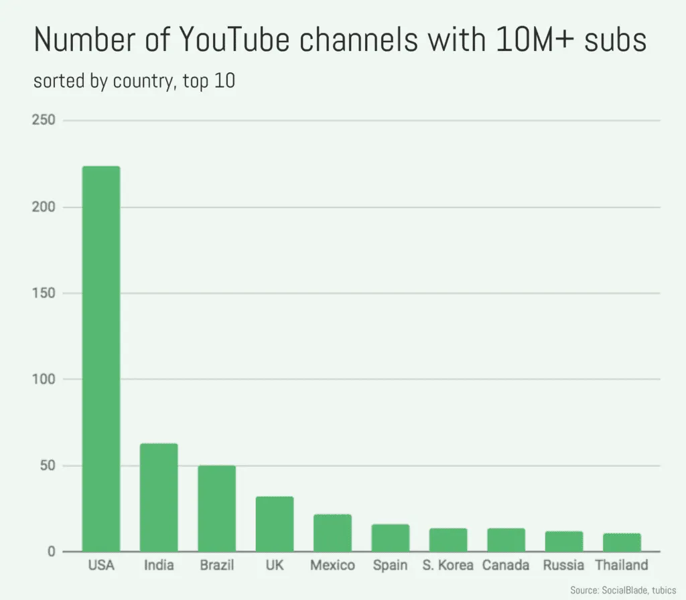
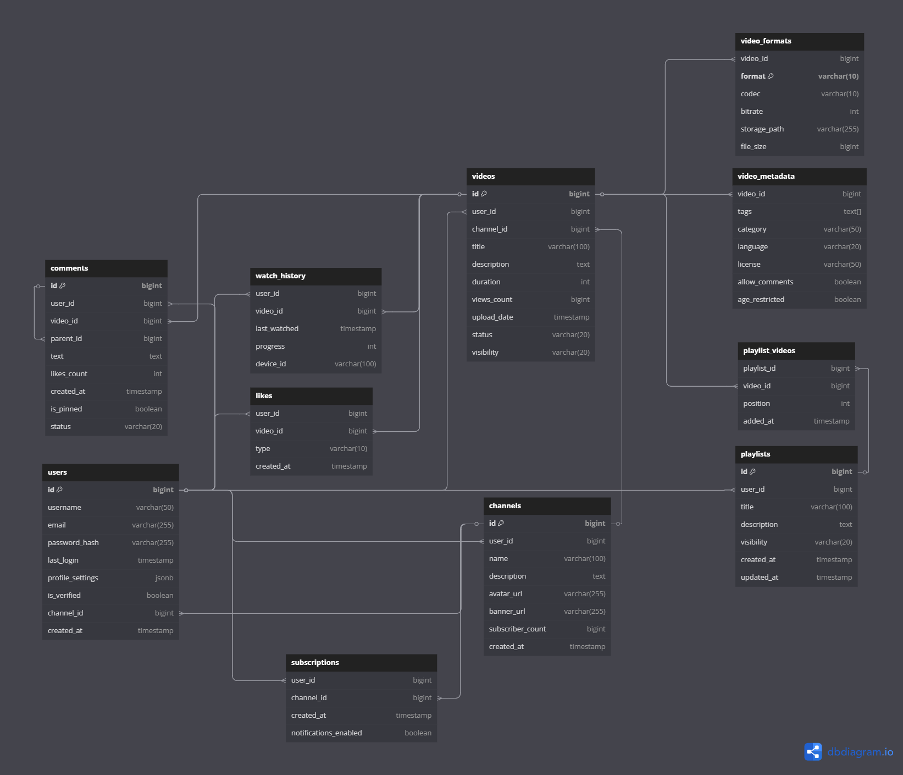

## 1. Тема и Целевая Аудитория

Youtube — это глобальная видеохостинговая платформа, объединяющая создателей и зрителей через возможность загрузки, просмотра, оценки и обсуждения видеоконтента.

### MVP

- Регистрация и авторизация
- Видео (просмотр, загрузка)
- Оценка видео (лайк/дизлайк)
- Система рекомендаций видео
- Подписка на каналы
- Комментарии
- Плейлисты

Ключевые продуктовые решения:

- Адаптивная потоковая передача: YouTube использует Dynamic Adaptive Streaming over HTTP (DASH), что позволяет автоматически подстраивать качество видео под скорость интернета и, таким образом, эффективно буферизировать контент без остановки проигрывания видео [[1]](https://ieeexplore.ieee.org/document/7965686)

### Целевая аудитория

На 2025 год, YouTube пользуется 2.5 миллиардов активных пользователей в месяц (MAU) [[2]](https://www.demandsage.com/youtube-stats/).\
Ежедневно приложением пользуется 122 миллионов активных пользователей (DAU).

Интерфейс YouTube доступен в локализованной версии в 110 странах [3]:

Распределение пользователей YouTube по возрастным группам [[4]](https://www.oberlo.com/statistics/youtube-age-demographics):
Возрастная группа | Процентное соотношение
------------ | -------------
18-24 | 15.8%
25-34 | 21.7%
35-44 | 18.5%
45-54 | 14%
55-64 | 9.9%
65+ | 9.5%

Распределение пользователей YouTube по полу [[5]](https://www.statista.com/statistics/1287032/):
Пол | По миру | США
-------------| ------- | ---
Мужской | 54.3% | 48.8%
Женский | 45.7% | 51.2%

Распределение пользователей YouTube по странам [[6]](https://www.statista.com/statistics/280685/number-of-monthly-unique-youtube-users/):
Страны | Количество активных пользователей в месяц
---------------- | -------------
Индия | 476M
США | 238M
Бразилия | 147M
Индонезия | 139M
Мексика | 84.2M
Япония | 79.4M
Пакистан | 66.1M
Германия | 65.7M
Вьетнам | 63M
Филиппины | 58.1M

Список стран, в которых Youtube заблокирован, и их трафик не входит статистику:

- Китай (не считая Гонконг и Макао)
- Эритрея
- Иран
- Северная Корея
- Туркменистан
- Южный Судан

Официально, YouTube все еще не был заблокирован в России.

Распределение подписчиков сервисов с доступом к YouTube на vMVPD (Smart TV, стриминговые платформы и т.д.) [[7]](https://www.statista.com/statistics/805276/):
vMVPD сервис | Количество подписчиков
------------ | -------------
YouTube TV | 7.9M
Hulu + Live TV | 4.4M
Sling TV | 2M
Fubo | 1.5M

### Список источников

1. Barman, Nabajeet; Martini, Maria G. (May 2017). "H.264/MPEG-AVC, H.265/MPEG-HEVC and VP9 codec comparison for live gaming video streaming". 2017 Ninth International Conference on Quality of Multimedia Experience (QoMEX). pp. 1–6. doi:[10.1109/QoMEX.2017.7965686](https://ieeexplore.ieee.org/document/7965686)
2. https://www.demandsage.com/youtube-stats/
3. На странице [youtube.com](https://www.youtube.com/) во вкладке Настройки>Страна
4. https://www.oberlo.com/statistics/youtube-age-demographics
5. https://www.statista.com/statistics/1287032/
6. https://www.statista.com/statistics/280685/number-of-monthly-unique-youtube-users/
7. https://www.statista.com/statistics/805276/

## 2. Расчет нагрузки

### Продуктовые метрики

- Месячная аудитория (MAU): 2.5 млрд [1]
- Дневная аудитория (DAU): 122 млн [1]

### Средний размер хранилища пользователя

#### Профиль

Профиль пользователя включает:

- Имя пользователя: ~50 символов (UTF-8, 3 Б на символ) = 50 \* 3 Б = 150 Б

- Описание профиля: ~500 символов (UTF-8, 3 Б на символ) = 500 \* 3 Б = 1.5 КБ

- Аватар: ~11 КБ

- Баннер: ~60 КБ

- Метаданные (дата регистрации, настройки и т.д.): ~2 КБ

Итого размер профиля: 150 Б + 1.5 КБ + 11 КБ + 60 КБ + 2 КБ = 75 КБ

#### Видео

В среднем в минуту на платформу загружают 500 часов видео [1].

YouTube конвертирует каждое загруженное видео в разные разрешения, применяя современные кодеки (VP9, AV1), которые уменьшают размер видео без потери качества [2].

Допустим, среднее видео загружается с разрешением 1080p и транскодируется также в 720p, 360p, 144p.
Примерные битрейты:

| Разрешение | Битрейт (VP9/AV1) | Объем за 1 час\* |
| ---------- | ----------------- | ---------------- |
| 144p       | 0.08 Мбит/с       | 36 МБ            |
| 360p       | 0.4 Мбит/с        | 180 МБ           |
| 720p       | 1.5 Мбит/с        | 675 МБ           |
| 1080p      | 3 Мбит/с          | 1350 МБ          |

\*Формула: Битрейт (Мбит/с) × 3600 секунд / 8 = Объем (МБ)

Аудио так же хранится в нескольких форматах [3].
Допустим, аудио среднего видео хранится в opus и m4a:

| Формат | Битрейт    | Объем за 1 час\* |
| ------ | ---------- | ---------------- |
| opus   | 64 Кбит/с  | 28.1 МБ          |
| m4a    | 128 Кбит/с | 56.3 МБ          |

\*Формула: Битрейт (Кбит/с) × 3600 секунд / 8 / 1024 = Объем (МБ)

На 1 час загруженного видео хранится:

- Видео: 36 МБ + 180 МБ + 675 МБ + 1350 МБ = 2241 МБ
- Аудио: 28.1 МБ + 56.3 МБ = 84.4 МБ
- Метаданные: Название, описание, теги ~1 МБ.

Итого на 1 час видео приходится: 2241 МБ + 84.4 МБ + 1 МБ = 2.3 ГБ

На 500 часов: 2.3 ГБ \ 500 часов = 1.12 ТБ

Столько места в среднем тратится в хранилище за 1 минуту реального времени.
За месяц выходит: 1.12 ТБ _ 60 минут _ 24 часа \ 30 дней = 47.3 ПБ

В среднем на пользователя за месяц: 47.3 ПБ / 2.5 млрд (MAU) = 20.3 МБ

В среднем на пользователя за 20 лет: 20.3 МБ _ 12 месяцев _ 20 лет = **4.8 ГБ**

#### Комментарии

В среднем на видео приходится 4 комментария [4].

В среднем на Youtube загружают 3.7 млн видео в месяц [5].

Тогда в среднем на платформе оставляют комментариев за месяц: 4 \* 3.7 млн = 14.8 млн

В среднем на пользователя приходится комментариев за месяц: 14.8 млн / 2.5 млрд (MAU) = 0.00592

В среднем комментариев на пользователя за 20 лет: 0.00592 _ 12 месяцев _ 20 лет = 1.4

Пусть средний комментарий содержит 100 символов в кодировке UTF-8 и каждый символ в среднем занимает 3 Б.
Тогда один комментарий в среднем занимает: 100 \* 3 Б = 300 Б

Итого на комментарии одного пользователя за 20 лет в хранилище приходится: 1.4 \* 300 Б = **420 Б**

#### Плейлисты

##### Размер плейлиста

Каждый плейлист хранит:

- Название плейлиста: ~50 символов (UTF-8, 3 Б на символ) = 150 Б

- Описание плейлиста: ~100 символов (UTF-8, 3 Б на символ) = 300 Б

- Список видео: каждый элемент списка — это ID видео (например, 11-байтовый уникальный идентификатор) = N \* 11 Б

- Метаданные (дата создания, автор и т.д.): ~500 Б

Итого размер одного плейлиста: 150 Б + 300 Б + N _ 11 Б + 500 Б = 950 Б + N _ 11 Б, где N - количество видео в плейлисте

##### Расчет на одного пользователя

У каждого пользователя изначально есть два плейлиста: "Понравившиеся" и "Смотреть позже".

Каждую минуту пользователи смотрят 3*472_222 видео на Youtube [6].
Тогда всего просмотров на всех видео за все время существования платформы: 3_472_222 * 60 минут _ 24 часа _ 365 дней \_ 20 лет = 3.649999766×10¹³

Среднее соотношение просмотров к лайкам на видео - 5.78 % [7].
Тогда всего лайков оставлено на всех видео за все время существования платформы: 3.649999766×10¹³ просмотров \* 5.78% = 2.109699865×10¹²

В среднем у пользователя лайнутых видео: 2.109699865×10¹² лайков / 2.5 млрд (MAU) = 844

Тогда плейлист "Понравивишеся" одного пользователя в среднем занимает: 950 Б + 844 \* 11 Б = 10 КБ

В среднем у пользователя 1683 видео в "Смотреть позже", вычеслено среднее арифметическое по опросам на форумах 425800/253 = 1683 [8-12]

<!-- (
    2682 1086 0 0 4064 0 61 23 0 1 343 119 950 46 5000 4 0 5000 28 285 1000 989 746 1 888 60 104 5000 2901 100 3 5 214 1300 1600 2508 422 90 0 821 5000 5000 4997 3571 5000 2990 5000 5000 3000 5000 5000 37 4670 4026 5000 5000 821 977 1500 50 5000 4996 1426 2000 3849 120 1857 5000 4979 20 82 1732 564 1101 3667 6 1000 1000 953 5000 936 724 412 19 670 5000 100 21 1994 2300 334 4978 5000 5000 15 5000 710 89 4919 250 250 1500 12 1513 681 4999 5000 35 1000 5000 42 492 4932 1831 3554 5000 540 23 157 729 1713 3717 1916 49 656 530 100 1851 185 25 40 33 415 3813 2449 10 35 4810 1049 1200 896 1200 731 5000 186 100 2331 3405 5000 4000 2300 2211 872 5000 405 1511 5000 3900 0 774 2000 0 1300 5000 4000 2583 1677 3408 138 100 0 50 550 273 3 3 700 60 20 1 300 178 1600 3612 1421 100 3500 4879 43 540 419 300 4250 127 290 0 175 3 52 3172 200 1900 512 5000 1340 911 160 713 4696 503 1900 234 1092 813 371 1540 1809 2616 3989 12 350 100 1500 29 4919 241 2316 2274 117 2406 1 4439 15 500 392 1436 2800 1434 712 400 5000 1000 467 2275 939 1823 5000 50 200 3 2100 3810 0
    = 425800/253 = 1683
)  -->

Тогда плейлист "Смотреть позже" одного пользователя в среднем занимает: 950 Б + 1683 _ 11 Б = 20 КБ
Допустим, так же пользователь создает за все время ~2 плейлиста по 16 видео = 2 _ (950 Б + 16 \* 11 Б) = 2.2 КБ

##### Место в хранилище на плейлисты на одного пользователя

| Плейлист       | Кол-во видео | Объем  |
| -------------- | ------------ | ------ |
| Понравивишеся  | 844          | 20 КБ  |
| Смотреть позже | 1683         | 10 КБ  |
| Прочее         | 32           | 2.2 КБ |

Всего: 20 КБ + 10 КБ + 2.2 КБ = 32.2 КБ

#### Подписки

##### Размер подписки

Каждая подписка хранит:

- ID канала: 11 Б

- ID пользователя: 11 Б

- Дата подписки: 8 Б (timestamp)

- Метаданные: ~500 Б

Итого размер одной подписки: 11 Б + 11 Б + 8 Б + 500 Б = 530 Б

##### Расчет на одного пользователя

В среднем у пользователя 113 подписок, вычеслено среднее арифметическое по опросу на форуме (83*15 + 79*45 + 57*75 + 42*105 + 37*546)/298 = 113 [13].
Тогда подписки одного пользователя занимают: 113 * 530 Б = 58.5 КБ

#### Средний размер хранилища пользователя

| Тип         | Количество | Объем   |
| ----------- | ---------- | ------- |
| Профиль     | 1          | 75 КБ   |
| Видео       | 2 ч        | 4.8 ГБ  |
| Комментарии | 1.4        | 420 Б   |
| Плейлисты   | 2          | 32.2 КБ |
| Подписки    | 113        | 58.5 КБ |

#### Среднее количество действий одного пользователя в день

Каждую минуту пользователи смотрят 3*472_222 видео на Youtube [14].
**Просмотр видео** = 3_472_222 * 60 минут \_ 24 часа / 122 млн (DAU) = **41**

Ежедневно на платформу загружают 2.4 млн видео [15].
**Загрузка видео** = 2.4 млн / 122 млн (DAU) = **0.029**

Средний коеффициент взаимодействия 3.97% (лайков/комментариев и т.д. от общего кол-ва просмотров на видео) [16].
Лайки и комменарии = 41 просмотр/день \* 3.97% = 1.63

Среднее количество лайков на видео 4% от общего кол-ва просмотров, комментариев - 0.05% от общего кол-ва просмотров [17].
Тогда среднее соотношение лайков к комментариям = 4:0.05 = 80:1
**Лайк** = 1.63 взаимодействий/день _ (80/81) = **1.61**
**Комментарий** = 1.63 взаимодействий/день _ (1/81) = **0.02**

Всего активных каналов - 113.9 млн каналов [18].
Средний прирост подпсисчиков в месяц - 1.9% [19].
Среднее количество подписчиков у канала - 61 [20].
**Подписка на канал** = (113.9 млн _ 61 _ 1.9%) / 30 дней / 122 млн (DAU) = **0.036**

Допустим, каждый месяц создается 0.01% плейлистов от кол-ва загружаемых видео.
**Создание плейлиста** = 0.01% \* 0.029 = **0.0000029**

За месяц на сайт заходят 77.9 млрд раз [15].
**Просмотр рекомендаций** = 77.9 млрд / 30 дней / 122 млн (DAU) = **22.3**

| **Тип**               | **Среднее количество действий одного пользователя в день** |
| --------------------- | ---------------------------------------------------------- |
| Просмотр видео        | 41                                                         |
| Загрузка видео        | 0.029                                                      |
| Лайк                  | 1.61                                                       |
| Комментарий           | 0.02                                                       |
| Подписка на канал     | 0.036                                                      |
| Создание плейлиста    | 0.0000029                                                  |
| Просмотр рекомендаций | 22.3                                                       |

### Технические метрики

#### Хранилище

Согласно расчетам, за 10 лет с 2012 по 2021 было загружено 2.5 ЭБ видео [21].
Предположим, что в среднем до 2012 года загружалось 50 ПБ видео в год, а после 2021 года в среднем 600 ПБ, тогда всего на платформу загружено 7 _ 50 ПБ + 2.5 ЭБ + 3 _ 600 ПБ = 4.7 ЭБ

Допустим примерно 75% активных в течение месяца пользователей имеют зарегистрированные аккаунты: 2.5 млрд (MAU) _ 75% = 1.875 млрд
И около 50% всех аккаунтов являются неактивными. Тогда общее количество зарегистрированных пользователей: 1.875 млрд _ 2 = 3.75 млрд.

На каждого данные каждого пользователя без учета загруженных видео в хранилище приходится 75 КБ + 420 Б + 30 КБ + 58.5 КБ = 164 КБ
На данные всех пользователей: 3.75 млрд \* 164 КБ = 573 ТБ

Общий объем хранимых данных:
| Тип | Объем |
| ------ | ---------- |
| Видео | 4.7 ЭБ |
| Данные пользователей | 573 ТБ |

#### Сетевой трафик

Просмотр видео
Каждую минуту пользователи смотрят 3_472_222 видео на Youtube [6].
Поскольку, средняя продолжительность видео - 12 минут 26 секунд, [15] - то есть среднее видео длится значительно больше минуты и так как в расчетах мы ориентируемся в большей части на пиковый трафик, примем просмотры в секунду равными просмотрам в минуту - 3_472_222 RPS.
Допустим, средний просмотр видео - это просмотр 1 секунды видео в 1080p VP9/AV1 и аудио M4A:
1 с \* (3 Мбит/с + 128 Кбит/с) = 3.128 Мбит

Загрузка видео
Ежедневно на платформу загружают 2.4 млн видео [15].
Тогда RPS на загрузку видео: 2.4 млн / 24 часа / 60 минут / 60 секунд = 28
Допустим, средняя загрузка видео - это загрузка 1 секунды видео в 1080p MP4 AVC и аудио AAC:
1 с \* (5 Мбит/c + 256 Кбит/c) = 5.256 Мбит

Лайк
Посчитаем RPS исходя из полученных ранее данных на одного пользователя в день:
1.61 лайк/сутки \* 122 млн (DAU) / 24 часа / 60 минут / 60 секунд = 2273

Комментарий
Посчитаем RPS исходя из полученных ранее данных на одного пользователя в день:
0.02 комментарий/сутки \* 122 млн (DAU) / 24 часа / 60 минут / 60 секунд = 28

Подписка на канал
Посчитаем RPS исходя из полученных ранее данных на одного пользователя в день:
0.036 подписка/сутки \* 122 млн (DAU) / 24 часа / 60 минут / 60 секунд = 51

Создание плейлиста
Допустим, один плейлист состоит из 16 видео и занимает 950 Б + 16 _ 11 Б = 1.1 КБ
Посчитаем RPS исходя из полученных ранее данных на одного пользователя в день:
0.0000029 плейлист/сутки _ 122 млн (DAU) / 24 часа / 60 минут / 60 секунд = 0.004

Просмотр рекомендаций
Посчитаем RPS исходя из полученных ранее данных на одного пользователя в день:
22.3 раз/сутки \* 122 млн (DAU) / 24 часа / 60 минут / 60 секунд = 31488

| **Тип**                 | **RPS средний** | **RPS пиковый** | Пиковое потребление в теченние суток (Гбит/с)            | Суммарный суточный (Гбайт/сутки) |
| ----------------------- | --------------- | --------------- | -------------------------------------------------------- | -------------------------------- |
| Авторизация/регистрация | 1               | 2               | 2 RPS \* 0.5 КБ = 1 КБ/с = 0.000008                      | 0.0864                           |
| Просмотр видео          | 3_472_222       | 5_000_000       | 5000000 RPS \* 3.128 Мбит = 15640                        | 161.1 ПБ                         |
| Загрузка видео          | 28              | 50              | 50 RPS \* 5.256 Мбит = 262.8 Мбит/с = 0.263              | 2_840                            |
| Лайк                    | 2_273           | 4_000           | 4000 RPS \* 1.5 КБ = 48000 Кбит/с = 0.048                | 518                              |
| Комментарий             | 28              | 60              | 60 RPS \* 3 КБ = 1440 Кбит/с = 0.001                     | 11                               |
| Подписка на канал       | 51              | 80              | 80 RPS \* 0.5 КБ = 320 Кбит/с = 0.0003                   | 3.24                             |
| Создание плейлиста      | 0.004           | 0.01            | 0.01 RPS _ 1.1 КБ = 11500 КБ/с = 11.5 МБ/с _ 8 = 0.0...8 | 0.001                            |
| Просмотр рекомендаций   | 31_488          | 55_000          | 55000 RPS \* 50.6 КБ = 347875 Кбит/с = 0,348             | 3_758                            |
| **Итого**               |                 |                 | **250,66**                                               | **2.57 ПБ**                      |

### Список источников

1. https://www.demandsage.com/youtube-stats/
2. https://medium.com/@eugene-s/design-youtube-streaming-video-transcoding-b45aa8447851#:~:text=When%20a%20video%20is%20uploaded,the%20video%20for%20optimal%20streaming
3. https://github.com/yt-dlp/yt-dlp?tab=readme-ov-file#format-selection
4. https://www.statista.com/statistics/1466529/youtube-comments-by-video-format/
5. https://techjury.net/video/how-many-videos-are-uploaded-to-youtube-a-day/
6. https://www.statista.com/statistics/195140/new-user-generated-content-uploaded-by-users-per-minute/
7. https://www.statista.com/statistics/1373707/youtube-likes-to-views-ratio-us-canada/
8. https://www.reddit.com/r/youtube/comments/1gui54j/how_many_videos_do_you_have_on_the_watch_later/
9. https://www.reddit.com/r/youtube/comments/1ivloei/how_many_videos_do_you_have_watch_later_playlist/
10. https://www.reddit.com/r/youtube/comments/16r7629/how_many_videos_are_in_your_watch_later/
11. https://www.reddit.com/r/youtube/comments/1dqrs19/how_many_videos_do_you_have_on_your_watch_later/
12. https://www.reddit.com/r/youtube/comments/134dg9j/im_the_only_person_i_know_who_uses_the_watch/
13. https://www.reddit.com/r/youtube/comments/vbns42/how_many_youtube_channels_are_you_subscribed_to/
14. https://www.statista.com/statistics/195140/new-user-generated-content-uploaded-by-users-per-minute/
15. https://analyzify.com/statsup/youtube
16. https://www.statista.com/statistics/1485376/youtube-average-engagement-rate/
17. https://blog.promolta.com/how-to-measure-your-viewer-engagement
18. https://www.globalmediainsight.com/blog/youtube-users-statistics/
19. https://www.emarketer.com/industry-kpis/youtube-average-monthly-subscriber-growth-rate
20. https://www.intotheminds.com/blog/en/research-youtube-stats/
21. https://www.productmanagementexercises.com/9018/estimate-total-storage-capacity-for-all-videos-on-youtube

## 3. Глобальная балансировка нагрузки

### Функциональное разбиение по доменам

- **youtube.com** - основной домен
- **m.youtube.com** - домен для мобильной версии
- **studio.youtube.com** - домен для загрузки видео
- **.googlevideo.com** - домен для отдачи видео
- **.ytimg.com** - домен для отдачи изображений

### Обоснования расположения ДЦ

Youtube используется по всему миру, с наибольшим количеством активных пользователей в Индии и США.

Распределение активных пользователей YouTube в месяц по странам [1]:

| Страны    | Количество активных пользователей в месяц |
| --------- | ----------------------------------------- |
| Индия     | 476M                                      |
| США       | 238M                                      |
| Бразилия  | 147M                                      |
| Индонезия | 139M                                      |
| Мексика   | 84.2M                                     |
| Япония    | 79.4M                                     |
| Пакистан  | 66.1M                                     |
| Германия  | 65.7M                                     |
| Вьетнам   | 63M                                       |
| Филиппины | 58.1M                                     |

В США и Индии активных пользователей значительно больше, чем в других странах, поэтому следует отдельно рассмотреть расположение ДЦ в этих странах.

Карта плотности населения штатов США [2]:

(https://commons.wikimedia.org/wiki/File:Population_density_of_U.S._counties.png)

США:

- Сиэтл, Вашингтон
- Сан-Франциско, Калифорния
- Лос-Анджелес, Калифорния
- Денвер, Колорадо
- Даллас, Техас
- Атланта, Джорджия
- Чикаго, Иллинойс
- Вашингтон DC

Индия
(https://www.mapsofindia.com/maps/india/population.htm)

- Нью-Дели
- Мумбаи
- Хайдарабад

Плотность населения по миру:
(https://reliefweb.int/map/world/population-densities-world)

Южная Америка:

- Сан-Паулу, Бразилия
- Сантьяго, Чили
- Лима, Перу

Европа:

- Стокгольм, Швеция
- Москва, Россия
- Екатеринбург, Россия
- Лондон, Великобритания
- Амстердам, Нидерланды
- Париж, Франция
- Франкфурт-на-Майне, Германия
- Варшава, Польша
- Милан, Италия
- Мадрид, Испания
- Стамбул, Турция

Азия:
(https://www.reddit.com/r/MapPorn/comments/ch67vm/population_density_in_asia_oc/)

- Нью-Дели, Индия
- Мумбаи, Индия
- Хайдарабад, Индия
- Сеул, Южная Корея
- Токио, Япония
- Сингапур

Африка:

- Абуджа, Нигерия

Вот как выглядит итоговое расположение всех дата-центров:

Посмотреть на интерактивной карте: https://yandex.ru/maps/?um=constructor%3A50a5bea29c9714192d3f5321bcb309b6439ff4a18d79808b3d7b6dec0c04129c&source=constructorLink

### Расчет распределения запросов

Выделим главные виды запросов:

- **youtube.com**/**m.youtube.com** - скачивание основной статики и запросы к АПИ
- **.googlevideo.com** - скачивание видео
- **.ytimg.com** - скачивание изображений
- **studio.youtube.com** - загрузка видео

#### Скачивание основной статики и запросы к АПИ

Посчитаем MAU каждого региона по статистике подрегионов: (https://www.globalmediainsight.com/blog/youtube-users-statistics/#YouTube_Monthly_Traffic_by_Country)

| Регион                    | Подрегион           | MAU, млн  |
| ------------------------- | ------------------- | --------- |
| Азия/Тихоокеанский регион | Южная Азия          | 580.1     |
|                           | Юго-Восточная Азия  | 332.6     |
|                           | Восточная Азия      | 151.3     |
|                           | **Итого**           | **1064**  |
| Европа                    | Западная Европа     | 162.6     |
|                           | Южная Европа        | 111.3     |
|                           | Восточная Европа    | 91.8      |
|                           | Северная Европа     | 89        |
|                           | **Итого**           | **454.7** |
| Северная Америка          | Северная Америка    | 279.1     |
|                           | **Итого**           | **279.1** |
| Южная Америка             | Южная Америка       | 262       |
|                           | Центральная Америка | 106.6     |
|                           | Карибский бассейн   | 9.6       |
|                           | **Итого**           | **378.2** |
| Ближний Восток и Африка   | Ближний Восток      | 150.7     |
|                           | Северная Африка     | 97.1      |
|                           | Западная Африка     | 42.2      |
|                           | Южная Африка        | 25.8      |
|                           | Восточная Африка    | 9.4       |
|                           | **Итого**           | **325.2** |
| Океания                   | Океания             | 25.5      |
|                           | **Итого**           | **25.5**  |

Трафик посещений YouTube.com в месяц по странам:
https://www.statista.com/statistics/1357163/youtube-global-monthly-visits-by-country/

    MAU: https://www.statista.com/statistics/280685/number-of-monthly-unique-youtube-users/

| Страна      | Трафик/месяц | Регион             | MAU, млн | % от MAU региона    |
| ----------- | ------------ | ------------------ | -------- | ------------------- |
| США         | 11.7 млрд    | Северная Америка   | 253      | 253 / 279.1 = 90.65 |
| Южная Корея | 8.25 млрд    | Азия/Тихоокеанский | 43.4     | 43.4 / 1064 = 4.08  |
| Индия       | 4.2 млрд     | Азия/Тихоокеанский | 491      | 491 / 1064 = 46.15  |
| Бразилия    | 3.6 млрд     | Южная Америка      | 144      | 144 / 378.2 = 38.08 |

Теперь посчитаем трафик загрузки основной статики и АПИ по регионам:

| Регион             | Трафик/месяц\*                                              | Трафик/секунда\*\* |
| ------------------ | ----------------------------------------------------------- | ------------------ |
| Северная Америка   | 11.7 млрд / 90.65% = 12.907 млрд                            | **4980**           |
| Азия/Тихоокеанский | ( 8.25 млрд + 4.2 млрд ) / ( 4.08% + 46.15% ) = 24.786 млрд | **9563**           |
| Южная Америка      | 3.6 млрд / 38.08% = 9.454 млрд                              | **3647**           |

\* Формула: (Трафик/месяц подрегиона) / (% MAU подрегиона от MAU региона) = Трафик/месяц региона

\*\* Формула: (Трафик/месяц региона) / 30 дней / 24 часа / 60 минут / 60 секунд = Трафик/секунду региона (RPS)

Для недостающих регионов придется посчитать RPS менее точно.
Аппроксимируем средний RPS на миллион активных пользователей в месяц из имеющихся данных: \
( 4980 + 9563 + 3647 ) / ( 279.1 млн + 1064 млн + 378.2 млн ) = 10.568 RPS/миллион MAU

Тогда RPS загрузки основной статики и АПИ по оставшимся регионам:

| Регион                  | MAU, млн | Трафик/секунда\* |
| ----------------------- | -------- | ---------------- |
| Европа                  | 454.7    | **4805**         |
| Ближний Восток и Африка | 325.2    | **3437**         |
| Океания                 | 25.5     | **269**          |

\* Формула: MAU в млн \* 10.568 RPS/миллион MAU = RPS

#### Скачивание видео

Каждую минуту пользователи смотрят 3_472_222 видео на Youtube.
https://www.statista.com/statistics/195140/new-user-generated-content-uploaded-by-users-per-minute/

Поскольку подавляющее большинство видео на Youtube длятся больше минуты и мы в большей части ориентируемся на пиковый трафик, предположим, что столько же запросов на загрузку видео (пакетов по несколько секунд) пользователи запрашивают в секунду.

Распределение просмотров видео и подсчет RPS загрузки видео по регионам:

    просмотры: https://www.globalmediainsight.com/blog/youtube-users-statistics/#YouTube_Monthly_Traffic_by_Country

| Регион                    | Просмотры, % | RPS\*         |
| ------------------------- | ------------ | ------------- |
| Азия/Тихоокеанский регион | 30%          | **1_041_666** |
| Европа                    | 27%          | **937_500**   |
| Северная Америка          | 27%          | **937_500**   |
| Южная Америка             | 10%          | **347_222**   |
| Ближний Восток и Африка   | 5%           | **173_611**   |
| Океания                   | 2%           | **69_444**    |

\* Просмотры, % от общего кол-ва \* общий RPS = RPS региона

#### Скачивание изображений

Поскольку подавляющая часть запросов - на получение контента, не на его публикацию, - представим что все запросы на youtube.com - на посещение страницы либо связаны с прогрузкой части страницы (скролл комментариев).
Допустим, на один визит любой страницы приходится 15 запросов превью/аватарок.

| Регион                    | RPS youtube.com | RPS скачивания изображний |
| ------------------------- | --------------- | ------------------------- |
| Азия/Тихоокеанский регион | 9563            | 9563 \* 15 = **143_445**  |
| Европа                    | 4805            | 4805 \* 15 = **72_075**   |
| Северная Америка          | 4980            | 4980 \* 15 = **74_700**   |
| Южная Америка             | 3647            | 3647 \* 15 = **54_705**   |
| Ближний Восток и Африка   | 3437            | 3437 \* 15 = **51_555**   |
| Океания                   | 269             | 269 \* 15 = **4035**      |

#### Загрузка видео

Каждую секунду загружается 30 видео
https://seo.ai/blog/how-many-videos-are-on-youtube

Чтобы реалистично распределить RPS по загрузке видео, нужно рассчитать, в каких регионах чаще выкладывают видео

Всего 995 каналов достигли 10 млн и более подписчиков
https://en.wikipedia.org/wiki/YouTube_Creator_Awards#cite_note-SBDiamond-25

Страны с наибольшим количеством каналов с 10 млн и более подписчиков:
https://www.tubics.com/blog/number-of-youtube-channels

| Страна         | Кол-во каналов с 10+ млн подписчиков | Регион                    |
| -------------- | ------------------------------------ | ------------------------- |
| США            | 225                                  | Северная Америка          |
| Индия          | 60                                   | Азия/Тихоокеанский регион |
| Бразилия       | 50                                   | Южная Америка             |
| Великобритания | 35                                   | Европа                    |
| Мексика        | 25                                   | Южная Америка             |
| Испания        | 20                                   | Европа                    |
| Южная Корея    | 20                                   | Азия/Тихоокеанский регион |
| Канада         | 20                                   | Северная Америка          |
| Россия         | 20                                   | Европа                    |
| Таиланд        | 20                                   | Азия/Тихоокеанский регион |
| Другие         | 500                                  |
| Всего          | 995                                  |

Остальные каналы, по странам которых статистики нет, распределим по MAU регионов.

| Регион                    | Известное кол-во каналов, % | % от MAU               | Кол-во нераспределенных каналов по % от MAU | Всего каналов   | % от всех каналов |
| ------------------------- | --------------------------- | ---------------------- | ------------------------------------------- | --------------- | ----------------- |
| Азия/Тихоокеанский регион | 60 + 20 + 20 = 100          | 1064 / 2526.4 = 42.1%  | 500 \* 42.1% = 210                          | 100 + 210 = 310 | 31.2%             |
| Европа                    | 35 + 20 + 20 = 75           | 454.7 / 2526.4 = 18%   | 500 \* 18% = 90                             | 75 + 90 = 165   | 17%               |
| Северная Америка          | 225 + 20 = 245              | 279.1 / 2526.4 = 11%   | 500 \* 11% = 55                             | 245 + 55 = 300  | 30.2%             |
| Южная Америка             | 50 + 25 = 75                | 378.2 / 2526.4 = 15%   | 500 \* 15% = 75                             | 75 + 75 = 150   | 15.1%             |
| Ближний Восток и Африка   | -                           | 325.2 / 2526.4 = 12.9% | 500 \* 12.9% = 65                           | 65              | 6.5%              |
| Океания                   | -                           | 25.5 / 2526.4 = 1%     | 500 \* 1% = 5                               | 5               | 0.5%              |
| Остаток                   | 500                         | -                      | -                                           | -               | -                 |
| Всего                     | 995                         | 100%                   | 500                                         | 900             | 100%              |

Допустим, распределение популярных каналов (10+ млн подписчиков) по регионам отражает, в каком соотношении выкладывают видео создатели контента из разных регионов.
Еще раз - по статистике, приведенной перед расчетами, RPS загрузки видео по всему миру - 30 видео/секунда.

| Регион                    | % от трафика загрузки видео | RPS загрузки видео    |
| ------------------------- | --------------------------- | --------------------- |
| Азия/Тихоокеанский регион | 31.2%                       | 30 \* 31.2% = **9**   |
| Европа                    | 17%                         | 30 \* 17% = **5**     |
| Северная Америка          | 30.2%                       | 30 \* 30.2% = **9**   |
| Южная Америка             | 15.1%                       | 30 \* 15.1% = **5**   |
| Ближний Восток и Африка   | 6.5%                        | 30 \* 6.5% = **2**    |
| Океания                   | 0.5%                        | 30 \* 0.5% = **0.15** |
| Всего                     | 100%                        | 30                    |

### Распределение запросов

| Регион                    | Статика и АПИ | Скачивание видео | Скачивание изображений | Загрузка видео |
| ------------------------- | ------------- | ---------------- | ---------------------- | -------------- |
| Азия/Тихоокеанский регион | 9563          | 1_041_666        | 143_445                | 9              |
| Европа                    | 4805          | 937_500          | 72_075                 | 5              |
| Северная Америка          | 4980          | 937_500          | 74_700                 | 9              |
| Южная Америка             | 3647          | 347_222          | 54_705                 | 5              |
| Ближний Восток и Африка   | 3437          | 173_611          | 51_555                 | 2              |
| Океания                   | 269           | 69_444           | 4035                   | 0.15           |

### Схема DNS-балансировки

Используем Geo-based DNS, так как для настолько популярного сервиса критически важна минимизация задержек и отказоустойчивость. Пользователи будут направлены в ближайший дата-центр на основе их локации. Резервные ДЦ активируются автоматически при падении основного.

### Список источников

1. https://www.statista.com/statistics/280685/number-of-monthly-unique-youtube-users/

## 4. Локальная балансировка нагрузки

### Схема балансировки для входящих и межсервисных запросов

L4-балансировщик: LVS с Direct Routing по схеме Active-Active
L7-балансировщик: NGINX выполняет функции HTTP Reverse Proxy, терминации SSL
Используется алгоритм Least Connections для оптимального распределения нагрузки между бекендами

### Cхема резервирования

Для обеспечения отказоустойчивости LVS используется механизм Keepalived с протоколом VRRP. В случае выхода из строя одного L4-балансировщика, функции мастера берет на себя резервный узел.

L7-балансировщик: экземпляры Nginx объединены в кластер Kubernetes автоматически масштабирует активные поды через auto-scaling, отслеживает их состояние через readiness-пробы и перенаправляет трафик только на рабочие поды.

### Расчет количества балансировщиков

Среднее время работы процессора на запрос с постоянной сессией, сокращенным рукопажатием, и полным рукопожатем составляет 0,339 мс, 0,505 мс и 0,652 мс соответственно (https://www.ibm.com/docs/en/cics-ts/6.x?topic=performance-ssl-handshake-overhead)

Для cокращения количества round-трипов до одного при повторных подключениях, терминируем SSL на уровне L7 при помощи сокращенных рукопажатий и session storage.

Помимо терминации SSL, учтем парсинг HTTP, маршрутизацию, логирование и мониторинг - оверхед ~0.2 мс на каждый запрос.

Примем среднюю нагрузку на ядро ноды Kubernetes при auto-scaling равной 65% - 650 мс/с

Допустим, распределение запросов с постоянной сессией, сокращенным рукопажатием, и полным рукопожатем будет следующим:

| Тип                     | Доля от RPS | Нагрузка от всех запросов на одно ядро | Нагрузка от одного запроса | RPS на одно ядро          |
| ----------------------- | ----------- | -------------------------------------- | -------------------------- | ------------------------- |
| Постоянная сессия       | 80%         | 650 мс \* 80% = 520 мс                 | 0.339 + 0.2 = 0.539 мс     | 520 мс / 0.539 мс = 965   |
| Сокращенное рукопожатие | 15%         | 650 мс \* 15% = 98 мс                  | 0.505 + 0.2 = 0.705 мс     | 98 мс / 0.705 мс = 139    |
| Полное рукопожатие      | 5%          | 650 мс \* 5% = 32 мс                   | 0.652 + 0.2 = 0.852 мс     | 32 мс / 0.852 мс = 38     |
| Всего                   | -           | 650 мс                                 | -                          | 965 + 139 + 38 = **1142** |

Получилось ~1142 запросов в секунду на ядро при загрузке 65%.

Допустим, каждый балансировщик (нода k8s на виртуальной машине или целом сервере) имеет 16 ядер.

Поскольку подавляющее количество запросов - это запросы на просмотр видео, сосредоточимся на них.
RPS запросов по регионам берем из расчетов в пункте 3 (датацентров в Океании мы не поставили, поэтому прибавим трафик оттуда к Азии):

| Регион                    | Просмотры, %   | RPS\*                              | Кол-во ядер                | Кол-во балансировщиков |
| ------------------------- | -------------- | ---------------------------------- | -------------------------- | ---------------------- |
| Азия/Тихоокеанский регион | 30% + 2% = 32% | 1_041_666 + 69_444 = **1_111_110** | 1_111_110 / 1142 = **973** | 973 / 16 = **61**      |
| Европа                    | 27%            | **937_500**                        | 937_500 / 1142 = **821**   | 821 / 16 = **51**      |
| Северная Америка          | 27%            | **937_500**                        | 937_500 / 1142 = **821**   | 821 / 16 = **51**      |
| Южная Америка             | 10%            | **347_222**                        | 347_222 / 1142 = **304**   | 304 / 16 = **19**      |
| Ближний Восток и Африка   | 5%             | **173_611**                        | 173_611 / 1142 = **152**   | 152 / 16 = **10**      |

## 5. Логическая схема БД

https://dbdiagram.io/d/youtube-680ec79b1ca52373f590de13
